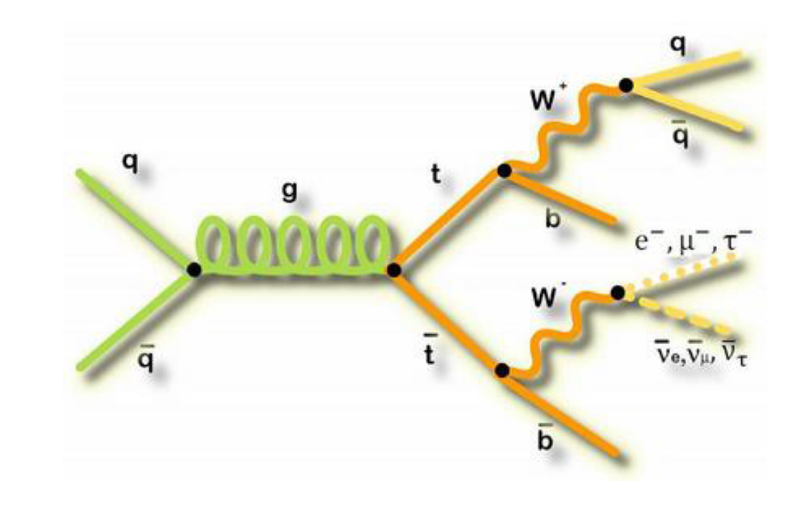
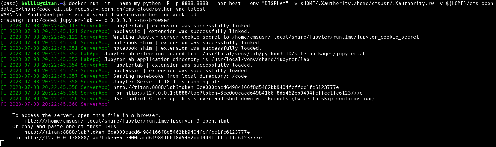
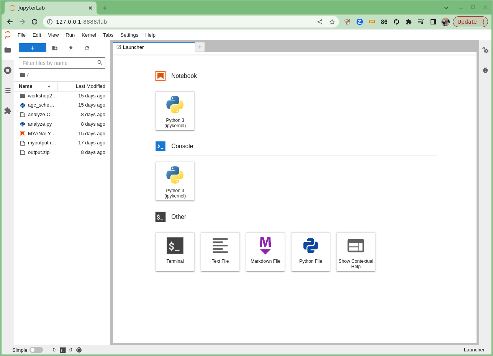

## Physics introduction

In this lesson, you will be walked through a mini-reproduction of a 2017 analysis from the CMS collaboration. The cross-section
for the production of top-quark / anti-top-quark pairs in proton-proton collisions was measured. Put another way, 
we measured the probability that a top-quark and an anti-top quark pair are produced when protons are collided
at a center-of-mass energy of 13 TeV. 

{:width="50%"}.

To go into a bit more detail 
in this simplified analysis we will be working towards a measurement of the [top and anti-top quark production cross section](https://link.springer.com/content/pdf/10.1007/JHEP09(2017)051.pdf) $$ \sigma_{t\bar{t}} $$.
The data are produced in proton-proton collisions at $$\sqrt{s}$$ = 13 TeV at the beginning of Run 2 of the LHC. We will be examining the lepton+jets final state
$$
t\bar{t} \rightarrow (bW^{+})(\bar{b}W_{-}) \rightarrow bq\bar{q} bl^{-}\bar{\nu_{l}}
$$
which is characterized by one lepton (here we look at electrons and muons only), significant missing transverse energy, and four jets, two of which are identified as b-jets.

Depending on how much background you have, try to read or at least skim the paper
and see how much you can get out of it. We'll discuss it in more detail in our first
episode when we meet. 

## Set up your computing environment. 

We will attempt to use tools that are built on modern, powerful and efficient python ecosystems.  In particular, we will use the **Columnar Object Framework For Effective Analysis** ([Coffea](https://coffeateam.github.io/coffea/)), which will provide us with *basic tools and wrappers for enabling not-too-alien syntax when running columnar Collider HEP analysis*.

### Start up Docker and JupyterLab

> ## Type out the following commands for this episode!
> For this next section, you'll be asked to type out the provided commands in a [Jupyter notebook](https://jupyter.org/), a 
> popular development environment that allows you to use python in an interactive way. 
> 
> *Please enter in these commands yourself for this episode.*
{: .callout}

To create or run these notebooks, we will
* Start the python docker container
* Install some necessary extra module (this only needs to be done once)
* Launch [Jupyter Lab](https://jupyterlab.readthedocs.io/en/latest/), an application that makes it easier to work with Jupyter Notebooks
* Create a new Jupyter Notebook for this episode.

**Start Docker**
If you have already successfully installed and run the Docker example with python tools, then you need only execute the following command.
~~~
docker start -i my_python  #give the name of your container
~~~
{: .language-bash}

 If this doesn't work, return to the [*python tools Docker container*](https://cms-opendata-workshop.github.io/workshop2023-lesson-docker/03-docker-for-cms-opendata/index.html#python-tools-container) lesson to work through how to start the container.

**Install the extra libraries**

(*If you did this already by following the [setup](https://cms-opendata-workshop.github.io/workshop2023-lesson-ttbarljetsanalysis/setup.html)
 section of this lesson, then you needn't do this part again.*)

In order to use the `coffea` framework for our analysis, we need to install these additional packages directly in our container.  We are adding 
`cabinetry` as well because we will use it later in our last episode. *This can take a few minutes to install.*
~~~
pip install vector hist mplhep coffea=0.7 cabinetry
~~~
{: .language-bash}

Also, download [this file](https://raw.githubusercontent.com/cms-opendata-workshop/workshop2022-lesson-ttbarljetsanalysis-payload/master/trunk/agc_schema.py), which is our starting schema.  Directly in your `/code` area (or locally in your `cms_open_data_python` directory) you can simply do:

~~~
wget  https://raw.githubusercontent.com/cms-opendata-workshop/workshop2022-lesson-ttbarljetsanalysis-payload/master/trunk/agc_schema.py
~~~
{: .language-bash}

**Launch Jupyter Lab**
In your docker python container, type the following.
 
> ~~~
> jupyter-lab --ip=0.0.0.0 --no-browser
> ~~~
> {: .language-bash}

> ## Launching Jupyter Lab
> You should see something like this in your Docker container terminal when you type the above `jupyter-lab` command.
> 
{: .callout}

In the image above you can see the output when I start `jupyter-lab` on my computer. Yours won't say *exactly*
the same thing, but it should be similar. Take note of the last two lines that start with `http://`. Start up a 
browser locally on your laptop or desktop (not from the Docker container). Copy one of those 
URLs and paste it into the browser. If the first URL doesn't work, try the other. 

If it works you'll see something in your browser similar to the following image!

> ## Launching Jupyter Lab
> If Jupyter Lab launched, you'll see something like this.
> 
{: .callout}

Great! You're all set to begin the analysis!



