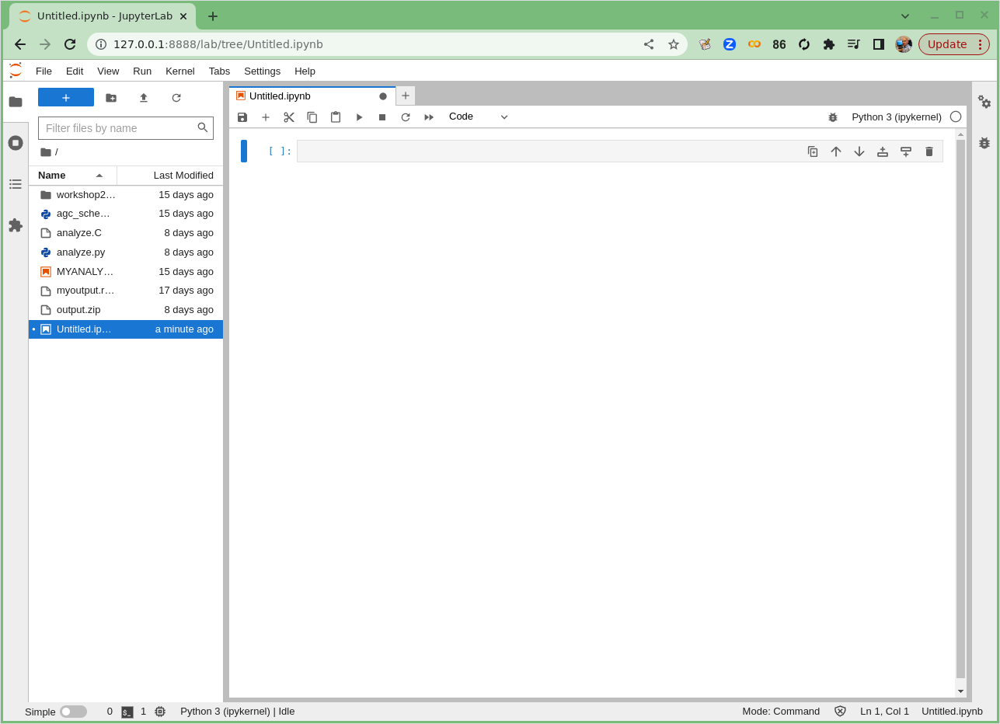
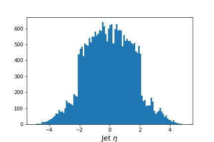
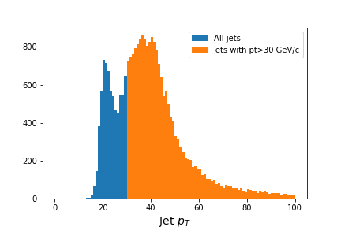

## Physics introduction

In this lesson, you will be walked through a mini-reproduction of a 2017 analysis from the CMS collaboration. The cross-section
for the production of top-quark / anti-top-quark pairs in proton-proton collisions was measured. Put another way, 
we measured the probability that a top-quark and an anti-top quark pair are produced when protons are collided
at a center-of-mass energy of 13 TeV. 

{:width="50%"}.

To go into a bit more detail 
in this simplified analysis we will be working towards a measurement of the [top and anti-top quark production cross section](https://link.springer.com/content/pdf/10.1007/JHEP09(2017)051.pdf) $$ \sigma_{t\bar{t}} $$.
The data are produced in proton-proton collisions at $$\sqrt{s}$$ = 13 TeV at the beginning of Run 2 of the LHC. We will be examining the lepton+jets final state
$$
t\bar{t} \rightarrow (bW^{+})(\bar{b}W_{-}) \rightarrow bq\bar{q} bl^{-}\bar{\nu_{l}}
$$
which is characterized by one lepton (here we look at electrons and muons only), significant missing transverse energy, and four jets, two of which are identified as b-jets.

**During the live WHEPP workshop this session will focus on equipping you to analyze a POET ROOT file in python and make a basic plot of a kinematic quantity.
Follow the ``Bonus Material" episodes to incorporate multiple simulated samples and apply the analysis selection criteria discussed in the [Event Selection](https://cms-opendata-workshop.github.io/workshopwhepp-lesson-selection/) lesson!**

## Slides

We want to motivate why we are encouraging you to look into some of these newer software tools.
By now, you should have heard about this particular measurement and how CMS reconstructs the different
physics objects. If you'd like, you can review that material with [these slides](https://docs.google.com/presentation/d/1DO3gYJwqpEiEbdZiPxnZ9go-O5qrMGuxqPts71pQctg/edit?usp=sharing).

Together, we will go through [these slides](https://docs.google.com/presentation/d/1kV4yX-v-_SQgo05iaP-qbf6daR4ajsUdcxSwTbB1vPE/edit?usp=sharing) to get a more complete overview of what goes into an analysis and to understand why we need
all these tools and how they make our life easier.

## Launch Jupyter notebook

In your docker python container, type the following.
 
> ~~~
> jupyter-lab --ip=0.0.0.0 --no-browser
> ~~~
> {: .language-bash}

**Start a new Jupyter notebook**

The top icon (under **Notebook**) says *Python 3 (ipykernel)*. 
Click on this icon. This should launch a new Jupyter notebook!

> ## Starting a new Jupyter notebook
> If your new Jupyter Notebook started, you'll see something like this.
> 
{: .callout}

In this Jupyter Lab environment, click on **File** (in the top right) and then from the dropdown 
menu select **Rename Notebook...**. You can call this notebook whatever you like but I have
called mine `analysis_example_prelesson.ipynb`.

For the remainder of this lesson, you'll be typing or cutting-and-pasting the commands you see here in the 
**Python** sections into
the Jupyter Notebook. To run those commands after you have typed them, you can press the little **Play** icon (right-pointing triangle)
or type **Shift + Enter** (to run the cell and advance) or **Ctrl + Enter** (to run the cell and *not* advance). 
Whichever you prefer.

> ## *Optional!* Using ipython
> If, for some reason, you don't want to use Jupyter, you can launch interactive python just by typing
> `ipython` in Docker Container (and not the `jupyter-lab` command) and then entering the python
> commands there. 
{: .callout}

## Columnar analysis basics with Awkward

Note: this and the next section on this episode are a recast (with some shameless copying and pasting) of [this notebook](https://github.com/iris-hep/analysis-grand-challenge/tree/main/workshops/agctools2022/coffea) by Mat Adamec presented during the [IRIS-HEP AGC Workshop 2022](https://indico.cern.ch/e/agc-tools-2). 

In one of the pre-exercises we learned how to access `ROOT` files (the standard use at the LHC experiments) using [uproot](https://cms-opendata-workshop.github.io/workshopwhepp-lesson-cpp-root-python/06-uproot/index.html#open-a-file) and why the [awkward](https://cms-opendata-workshop.github.io/workshop2023-lesson-cpp-root-python/07-awkward/#access-or-download-a-root-file-for-use-with-this-exercise) library can be very helpful when dealing with *jagged* arrays.

### Opening and exploring a POET file

Let's remember very quickly.  First, be sure to import the appropriate libraries:

~~~
import uproot
import awkward as ak
~~~
{: .language-python}

Let's open an example file. These are **flattened POET ROOT files**, in which the `TTree` objects for each individual physics object have been merged into one tree. We have produced these files for you!

Using `uproot`,

~~~
events = uproot.open('root://eospublic.cern.ch//eos/opendata/cms/upload/od-workshop/ws2021/myoutput_odws2022-ttbaljets-prodv2.0_merged.root')['events']
events
~~~
{: .language-python}

~~~
<TTree 'events' (275 branches) at 0x7fb46a8b5870>.
~~~
{: .output}

We now have an events tree. We can view its branches by querying its `keys()`:

~~~
events.keys()
~~~
{: .language-python}

~~~
['numberelectron', 'nelectron_e', 'electron_e', 'nelectron_pt', 'electron_pt', 'nelectron_px', 'electron_px', 'nelectron_py', 'electron_py', 'nelectron_pz', 'electron_pz', 'nelectron_eta', 'electron_eta', 'nelectron_phi', 'electron_phi', 'nelectron_ch', 'electron_ch', 'nelectron_iso', 'electron_iso', 'nelectron_veto', 'electron_veto', 'nelectron_isLoose', 'electron_isLoose', 'nelectron_isMedium', 'electron_isMedium', 'nelectron_isTight', 'electron_isTight', 'nelectron_dxy', 'electron_dxy', 'nelectron_dz', 'electron_dz', 'nelectron_dxyError', 'electron_dxyError', 'nelectron_dzError', 'electron_dzError', 'nelectron_ismvaLoose', 'electron_ismvaLoose', 'nelectron_ismvaTight', 'electron_ismvaTight', 'nelectron_ip3d', 'electron_ip3d', 'nelectron_sip3d', 'electron_sip3d', 'numberfatjet', 'nfatjet_e', 'fatjet_e', 'nfatjet_pt', 'fatjet_pt', 'nfatjet_eta', 'fatjet_eta', 'nfatjet_phi', 'fatjet_phi', 'nfatjet_ch', 'fatjet_ch', 'nfatjet_mass', 'fatjet_mass', 'nfatjet_corrpt', 'fatjet_corrpt', 'nfatjet_corrptUp', 'fatjet_corrptUp', 'nfatjet_corrptDown', 'fatjet_corrptDown', 'nfatjet_corrptSmearUp', 'fatjet_corrptSmearUp', 'nfatjet_corrptSmearDown', 'fatjet_corrptSmearDown', 'nfatjet_corrmass', 'fatjet_corrmass', 'nfatjet_corre', 'fatjet_corre', 'nfatjet_corrpx', 'fatjet_corrpx', 'nfatjet_corrpy', 'fatjet_corrpy', 'nfatjet_corrpz', 'fatjet_corrpz', 'nfatjet_prunedmass', 'fatjet_prunedmass', 'nfatjet_softdropmass', 'fatjet_softdropmass', 'nfatjet_tau1', 'fatjet_tau1', 'nfatjet_tau2', 'fatjet_tau2', 'nfatjet_tau3', 'fatjet_tau3', 'nfatjet_subjet1btag', 'fatjet_subjet1btag', 'nfatjet_subjet2btag', 'fatjet_subjet2btag', 'nfatjet_subjet1hflav', 'fatjet_subjet1hflav', 'nfatjet_subjet2hflav', 'fatjet_subjet2hflav', 'numberjet', 'njet_e', 'jet_e', 'njet_pt', 'jet_pt', 'njet_eta', 'jet_eta', 'njet_phi', 'jet_phi', 'njet_ch', 'jet_ch', 'njet_mass', 'jet_mass', 'njet_btag', 'jet_btag', 'njet_hflav', 'jet_hflav', 'njet_corrpt', 'jet_corrpt', 'njet_corrptUp', 'jet_corrptUp', 'njet_corrptDown', 'jet_corrptDown', 'njet_corrptSmearUp', 'jet_corrptSmearUp', 'njet_corrptSmearDown', 'jet_corrptSmearDown', 'njet_corrmass', 'jet_corrmass', 'njet_corre', 'jet_corre', 'njet_corrpx', 'jet_corrpx', 'njet_corrpy', 'jet_corrpy', 'njet_corrpz', 'jet_corrpz', 'btag_Weight', 'btag_WeightUp', 'btag_WeightDn', 'met_e', 'met_pt', 'met_px', 'met_py', 'met_phi', 'met_significance', 'met_rawpt', 'met_rawphi', 'met_rawe', 'numbermuon', 'nmuon_e', 'muon_e', 'nmuon_pt', 'muon_pt', 'nmuon_px', 'muon_px', 'nmuon_py', 'muon_py', 'nmuon_pz', 'muon_pz', 'nmuon_eta', 'muon_eta', 'nmuon_phi', 'muon_phi', 'nmuon_ch', 'muon_ch', 'nmuon_isLoose', 'muon_isLoose', 'nmuon_isMedium', 'muon_isMedium', 'nmuon_isTight', 'muon_isTight', 'nmuon_isSoft', 'muon_isSoft', 'nmuon_isHighPt', 'muon_isHighPt', 'nmuon_dxy', 'muon_dxy', 'nmuon_dz', 'muon_dz', 'nmuon_dxyError', 'muon_dxyError', 'nmuon_dzError', 'muon_dzError', 'nmuon_pfreliso03all', 'muon_pfreliso03all', 'nmuon_pfreliso04all', 'muon_pfreliso04all', 'nmuon_pfreliso04DBCorr', 'muon_pfreliso04DBCorr', 'nmuon_TkIso03', 'muon_TkIso03', 'nmuon_jetidx', 'muon_jetidx', 'nmuon_genpartidx', 'muon_genpartidx', 'nmuon_ip3d', 'muon_ip3d', 'nmuon_sip3d', 'muon_sip3d', 'numberphoton', 'nphoton_e', 'photon_e', 'nphoton_pt', 'photon_pt', 'nphoton_px', 'photon_px', 'nphoton_py', 'photon_py', 'nphoton_pz', 'photon_pz', 'nphoton_eta', 'photon_eta', 'nphoton_phi', 'photon_phi', 'nphoton_ch', 'photon_ch', 'nphoton_chIso', 'photon_chIso', 'nphoton_nhIso', 'photon_nhIso', 'nphoton_phIso', 'photon_phIso', 'nphoton_isLoose', 'photon_isLoose', 'nphoton_isMedium', 'photon_isMedium', 'nphoton_isTight', 'photon_isTight', 'nPV_chi2', 'PV_chi2', 'nPV_ndof', 'PV_ndof', 'PV_npvs', 'PV_npvsGood', 'nPV_x', 'PV_x', 'nPV_y', 'PV_y', 'nPV_z', 'PV_z', 'trig_Ele22_eta2p1_WPLoose_Gsf', 'trig_IsoMu20', 'trig_IsoTkMu20', 'numbertau', 'ntau_e', 'tau_e', 'ntau_pt', 'tau_pt', 'ntau_px', 'tau_px', 'ntau_py', 'tau_py', 'ntau_pz', 'tau_pz', 'ntau_eta', 'tau_eta', 'ntau_phi', 'tau_phi', 'ntau_ch', 'tau_ch', 'ntau_mass', 'tau_mass', 'ntau_decaymode', 'tau_decaymode', 'ntau_iddecaymode', 'tau_iddecaymode', 'ntau_idisoraw', 'tau_idisoraw', 'ntau_idisovloose', 'tau_idisovloose', 'ntau_idisoloose', 'tau_idisoloose', 'ntau_idisomedium', 'tau_idisomedium', 'ntau_idisotight', 'tau_idisotight', 'ntau_idantieletight', 'tau_idantieletight', 'ntau_idantimutight', 'tau_idantimutight']
~~~
{: .output}

Each of these branches can be interpreted as an awkward array. Let's examine their contents to remember that they contain *jagged* (non-rectangular) arrays:

~~~
muon_pt = events['muon_pt'].array()
print(muon_pt)
~~~
{: .language-python}

~~~
[[53.4, 0.792], [30.1], [32.9, 0.769, 0.766], ... 40], [37.9], [35.2], [30.9, 3.59]]
~~~
{: .output}

We could get the number of muons in each collision with:

~~~
ak.num(muon_pt, axis=-1)
~~~
{: .language-python}

~~~
<Array [2, 1, 3, 1, 1, 1, ... 1, 1, 1, 1, 1, 2] type='15090 * int64'>
~~~
{: .output}

A quick note about axes in awkward: **0 is always the shallowest, while -1 is the deepest**. In other words, axis=0 would tell us the number of subarrays (events), while axis=-1 would tell us the number of muons within each subarray.  This array is only of dimension 2, so `axis=1` or `axis=-1` are the same.  This usage is the same as for standard `numpy` arrays.

### Applying masks

The traditional way of analyzing data in HEP involves the event loop. In this paradigm, we would write an explicit loop to go through every event (and through every field of an event that we wish to make a cut on). This method of analysis is rather bulky in comparison to the columnar approach, which (ideally) has no explicit loops at all! Instead, the **fields of our data are treated as arrays and analysis is done by way of numpy-like array operations**.

Most simple cuts can be handled by masking. A **mask is a Boolean array** which is generated by applying a condition to a data array. For example, if we want only muons with pT > 10, our mask would be:

~~~
print(muon_pt > 10)
~~~
{: .language-python}

~~~
[[True, False], [True], [True, False, False], ... [True], [True], [True, False]]
~~~
{: .output}

Then, we can apply the mask to our data. The syntax follows other **standard array selection operations**: `data[mask]`. This will pick out only the elements of our data which correspond to a `True`.

Our mask in this case **must have the same shape** as our muons branch, and this is guaranteed to be the case since it is generated from the data in that branch. When we apply this mask, the output should have the same amount of events, but it should down-select muons - muons which correspond to False should be dropped. Let's compare to check:

~~~
print('Input:', muon_pt)
print('Output:', muon_pt[muon_pt > 10])
~~~
{: .language-python}

~~~
Input: [[53.4, 0.792], [30.1], [32.9, 0.769, 0.766], ... 40], [37.9], [35.2], [30.9, 3.59]]
Output: [[53.4], [30.1], [32.9], [28.3], [41.7], ... [42.6], [40], [37.9], [35.2], [30.9]]
~~~
{: .output}

We can also confirm we have fewer muons now, but the same amount of events:

~~~
print('Input Counts:', ak.sum(ak.num(muon_pt, axis=1)))
print('Output Counts:', ak.sum(ak.num(muon_pt[muon_pt > 10], axis=1)))

print('Input Size:', ak.num(muon_pt, axis=0))
print('Output Size:', ak.num(muon_pt[muon_pt > 10], axis=0))
~~~
{: .language-python}

~~~
Input Counts: 26690
Output Counts: 17274

Input Size: 15090
Output Size: 15090
~~~
{: .output}

> ## Challenge!
> How many muons have a transverse momentum (`pt`) greater than 30 GeV/c?
> 
> Revisit the output of `event.keys()`. How many jets in total were produced and how many have a 
> transverse momentum greater than 30 GeV/c?
>
> > ## Solution
> > We modify the above code to mask the muons with `muon_pt` > 30. 
> > We also make
> > use of the `jet_pt` variable to perform a similar calculation. 
> > ~~~
> > print('Input Counts:', ak.sum(ak.num(muon_pt, axis=1)))
> > print('Output Counts:', ak.sum(ak.num(muon_pt[muon_pt > 30], axis=1)))
> > ~~~
> > {: .language-python}
> > 
> > ~~~
> > Input Counts: 26690
> > Output Counts: 13061
> > ~~~
> > {: .output}
> > 
> > ~~~
> > jet_pt = events['jet_pt'].array()
> > 
> > print('Input Counts:', ak.sum(ak.num(jet_pt, axis=1)))
> > print('Output Counts:', ak.sum(ak.num(jet_pt[jet_pt > 30], axis=1)))
> > 
> > print('Input Counts:', ak.num(jet_pt, axis=0))
> > print('Output Counts:', ak.num(jet_pt[jet_pt > 30], axis=0))
> > ~~~
> > {: .language-python}
> > 
> > ~~~
> > Input Counts: 26472
> > Output Counts: 19419
> > Input Counts: 15090
> > Output Counts: 15090
> > ~~~
> > {: .output}
> > So we find that there are 13061 muons, taken from these 15090 proton-proton collisions that have
> > transverse momentum greater than 30 GeV/c. 
> > 
> > Similarly we find that there are 26472  jets, taken from these 15090 proton-proton collisions, and
> > 19419 of them have transverse momentum greater than 30 GeV/c.
> > 
> {: .solution}
{: .challenge}

Let's quickly make a simple histogram with the widely used [matplotlib](https://matplotlib.org/) library. 
First we will import it. 
~~~
import matplotlib.pylab as plt
~~~
{: .language-python}

When we make our histogram, we need to first "flatten" the awkward aray before passing it to `matplotlib`. 
This is because `matplotlib` doesn't know how to handle the jagged nature of `awkward` arrays. 

~~~
# Flatten the jagged array before we histogram it
values = ak.flatten(events['jet_eta'].array())

fig = plt.figure(figsize=(6,4))
plt.hist(values,bins=100,range=(-5,5))
plt.xlabel(f'Jet $\eta$',fontsize=14)
;
~~~
{: .language-python}
(*The semi-colon at the end of the code is just to suppress the output of whatever the last line
 of the python code in the cell.*)

> ## Output of `jet_eta` histogram
> 
{: .callout}

And here's how we could use the mask in our plot. 

~~~
# Flatten the jagged array before we histogram it
fig = plt.figure(figsize=(6,4))

values = ak.flatten(jet_pt)

plt.hist(values,bins=100,range=(0,100), label='All jets')
plt.hist(values[values>30],bins=100,range=(0,100), label='jets with pt>30 GeV/c')

plt.xlabel(f'Jet $p_T$',fontsize=14)
plt.legend()
;
~~~
{: .language-python}

> ## Output of `jet_pt` histogram with and without mask
> 
{: .callout}
